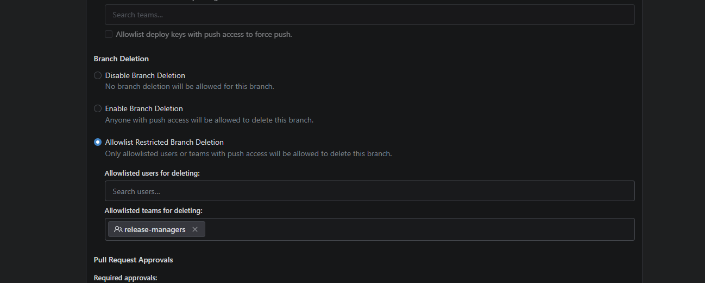

# Gitea protected branch deletion demo

Reproducible UI and API harness for the proposed protected-branch deletion
allowlists in [Gitea issue #33305](https://github.com/go-gitea/gitea/issues/33305).
It runs a locally built Gitea checkout, creates an organization repository, and
configures `release/*` so only members of `release-managers` may delete matching
branches.



## Quick start

Prerequisites: Docker Compose, Bash, curl, jq, and the normal Gitea frontend and
backend build dependencies.

```bash
git clone https://github.com/enoquefcd/gitea.git
cd gitea
git switch feat/allow-protected-branch-deletion

git clone https://github.com/enoquefcd/gitea-protected-branch-deletion-demo.git
cd gitea-protected-branch-deletion-demo
cp .env.example .env
# Edit .env: GITEA_SOURCE_DIR must be the absolute path to the Gitea checkout.

./scripts/build.sh
./scripts/bootstrap.sh
./scripts/smoke-api.sh
```

Then open <http://localhost:3000>. The bootstrap output prints the three local
demo accounts. Follow [UI_TESTS.md](UI_TESTS.md) for the manual checks.

The source build is deliberately low-impact by default: two build workers, a
1 GiB Node heap, and `nice` level 15. The container is limited to two CPUs,
1 GiB RAM, and 256 PIDs.

## What the smoke test covers

- A writer who is not in the deletion allowlist cannot delete `release/team-1`.
- A member of `release-managers` can delete that same protected branch.
- Removing that member from the team immediately denies deletion; restoring
  membership allows it again.
- An unprotected control branch keeps its normal deletion behavior.

The harness is supporting evidence for manual reproduction. The authoritative
regression coverage lives in the Gitea test suite in the implementation PR.

## Reset and stop

```bash
docker compose down
docker compose down --volumes  # also deletes the disposable demo data
```

All credentials and secrets in this repository are intentionally local-only.
Do not reuse this configuration for an exposed or production Gitea instance.
